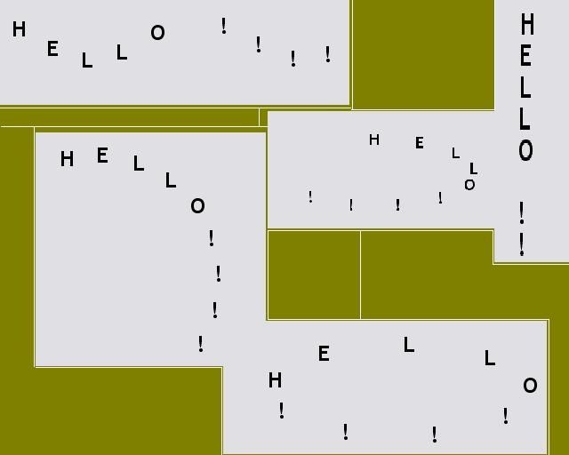



## text rotation effects

### Description

This prog takes a string and prints it to a picture with many effects. You can make a text on a circle or you can print text in any orientation . Just pure vb but not commented because is very simple if there is anything you can not understand please post it
 
### More Info
 
I have seen this effects in a cd labeling programme i have and i wondered how this can be done here is the result

My very first code posted here any comments accepted

             |
---                |---
**Submitted On**   |2004-03-10 14:30:04
**By**             |[koze](https://github.com/Planet-Source-Code/PSCIndex/blob/master/ByAuthor/koze.md)
**Level**          |Intermediate
**User Rating**    |5.0 (10 globes from 2 users)
**Compatibility**  |VB 4\.0 \(16\-bit\), VB 4\.0 \(32\-bit\), VB 5\.0, VB 6\.0
**Category**       |[Graphics](https://github.com/Planet-Source-Code/PSCIndex/blob/master/ByCategory/graphics__1-46.md)
**World**          |[Visual Basic](https://github.com/Planet-Source-Code/PSCIndex/blob/master/ByWorld/visual-basic.md)
**Archive File**   |[text\_rotat1718663102004\.zip](https://github.com/Planet-Source-Code/koze-text-rotation-effects__1-52287/archive/master.zip)

